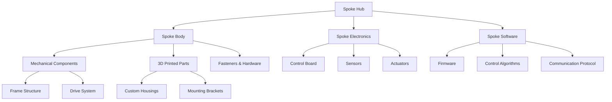
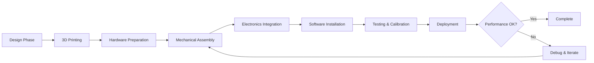
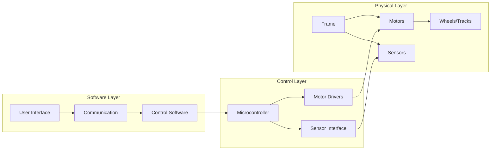
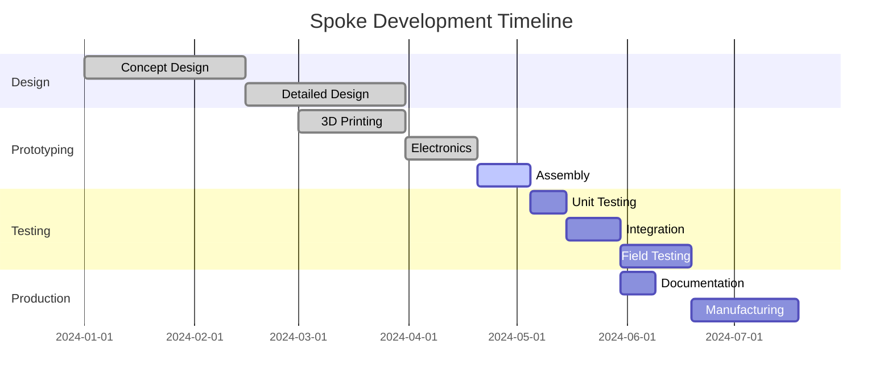
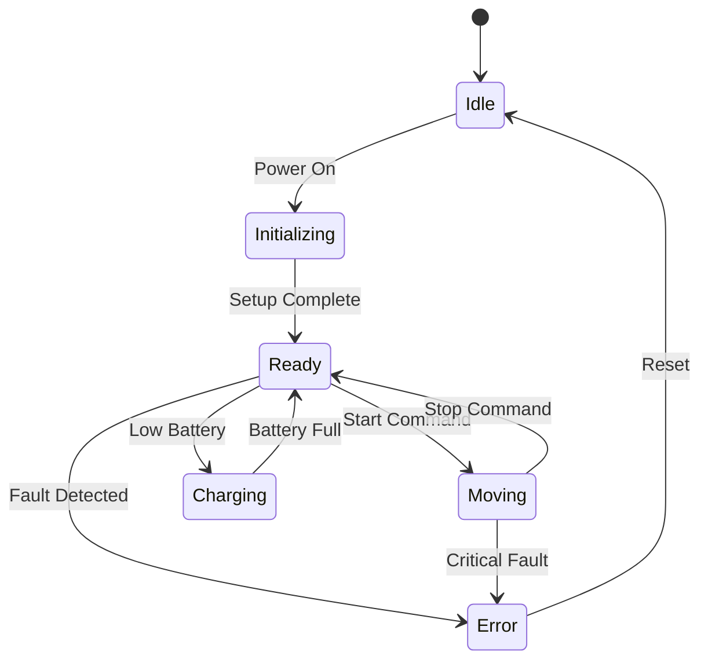
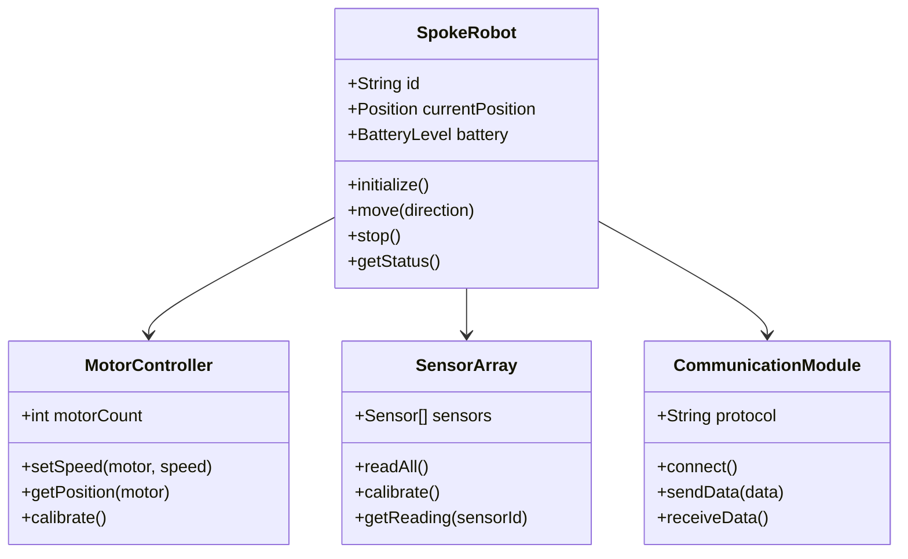

# Spoke Robotics System Overview

This page demonstrates Mermaid diagram capabilities for visualizing the Spoke robotics system architecture and workflows.

## System Architecture

## Assembly Workflow

## Component Dependencies

## Development Timeline

## State Machine Example

## Class Diagram

---

*This page demonstrates various Mermaid diagram types that can be used throughout the Spoke documentation to visualize system architecture, workflows, and relationships.*
